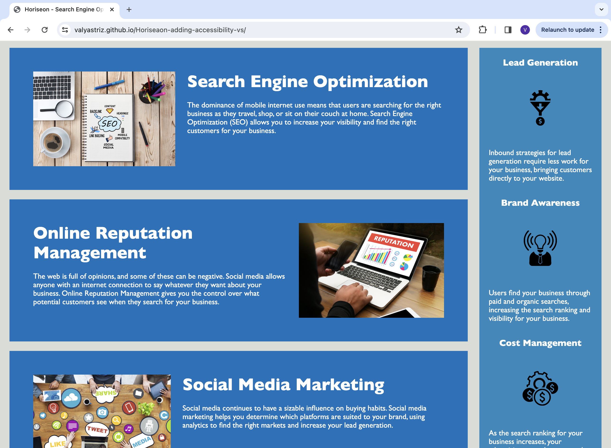
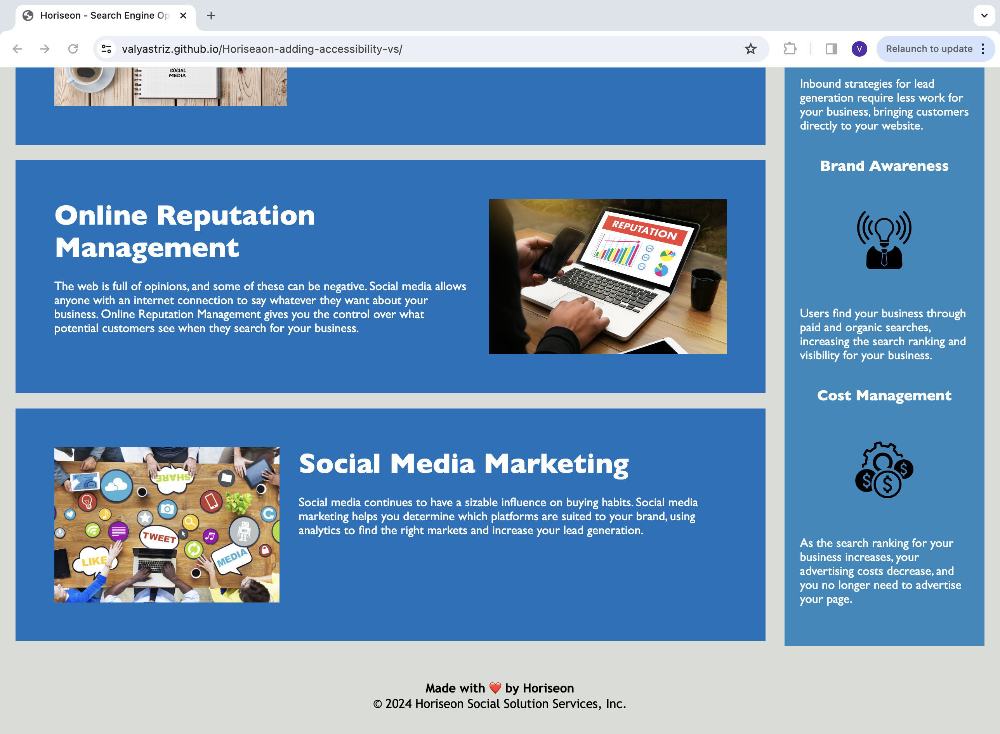

# Horiseon - Search Engine Optimization Services

## Description
The focus of this project is to update the Horiseon website to to ensure that it meets accessibilty standards and also optimize it for search engines. The main enhancements include incorporating semantic HTML elements for accessibility, organizing the structure of the HTML elements so they make logical sense and are easier to read, and also adding alternate descriptions for the images contained within the site. 

## User Story

```
AS A marketing agency
I WANT a codebase that follows accessibility standards
SO THAT our own site is optimized for search engines
```

## Acceptance Criteria

```
GIVEN a webpage meets accessibility standards
WHEN I view the source code
THEN I find semantic HTML elements
WHEN I view the structure of the HTML elements
THEN I find that the elements follow a logical structure independent of styling and positioning
WHEN I view the icon and image elements
THEN I find accessible alt attributes
WHEN I view the heading attributes
THEN they fall in sequential order
WHEN I view the title element
THEN I find a concise, descriptive title
```
## Mock-Up

The following images show the web application's appearance and functionality:





## Usage
1. Open the link to the Horiseon site in your browser: https://valyastriz.github.io/Horiseaon-adding-accessibility-vs/
2. Navigate through the site to view the accessibility features that were updated.

## Credits

This project was completed by Valentina Strizheus.
Original source code (as shown in the starter files) was provided by edEx OSU Bootcamp.
